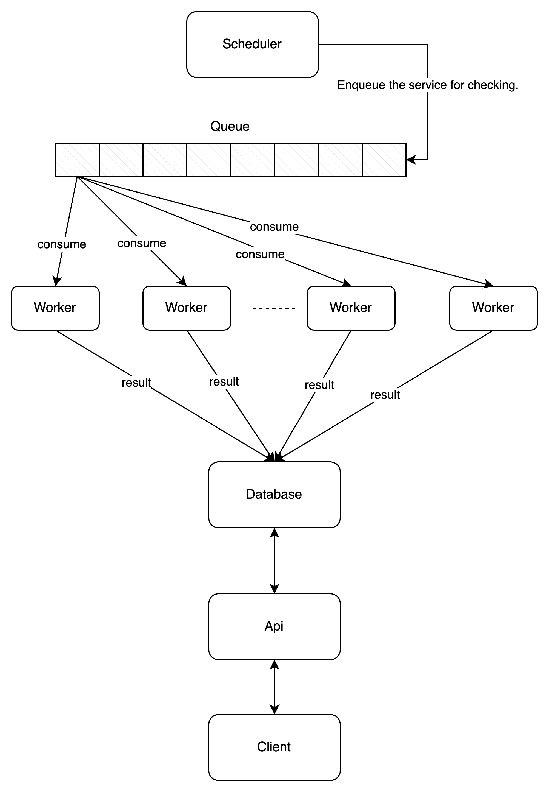

# Monitor Service

The system manages a list of services, which is specified in the sites.txt file. Periodically, 
at defined intervals (for example, every N seconds), the system checks the availability and 
response time of each service listed in the file.

## Table of Contents
- [Feature](#Feature)
- [Installation](#Installation)
- [Test](#Test)
- [Limitation](#Limitation)
- [Api](#Api)
- [Idea and Architecture](#Architecture)

## Feature
- Checks the availability and response time of each service listed in the file 
- Custom intervals and other configurations in the environment file (e.g., local.yml, ...)
- APIs to request the time to access the service, request a service with a maximum access time, request a service with a minimum access time, and track statistics of requests from users for all services.

## Installation

### Build from source
```sh
# Clone the repository
git clone https://github.com/mikenevermindng/Interview-test-task-3.git

# Run the build script
sh build.sh

# Optional: Configure Environment Variables
# Place the environment file in the 'env' folder with the filename <environment>.yml
# Adjust the 'APP_ENV' variable in the 'run.sh' or 'run-api.sh' accordingly.

# Start the monitoring service
sh run.sh

# Launch the API service
sh run-api.sh

# Alternatively, you can execute the following commands:
# For the monitor worker
APP_ENV=<environment> ./monitor

# For the API
APP_ENV=<environment> ./api
```

### Docker
```sh
git clone https://github.com/mikenevermindng/Interview-test-task-3.git


# Optional: Configure Environment Variables
# Place the environment file in the 'env' folder with the filename <environment>.yml
# Adjust the 'APP_ENV' variable in the docker-compose.yml accordingly.

# Execute the following command to start the application:
sudo docker compose up 
```

## Test
```sh
sh test.sh
```

## Limitation
- The monitoring system is limited by hardware resources and network bandwidth, which affects the number of services that can be monitored simultaneously at any given time. To restrict the number of services monitored concurrently, you can modify the value of `monitor.maxMonitorConcurrency` in environment files.
- To enhance system performance or increase testing accuracy, we can modify the following values: `monitor.maxRedirect` (maximum number of redirects, which helps reduce network bandwidth), `monitor.requestTimeout` (maximum response time limit for a service).

## API
### Request access time to a random service
```shell
curl --location '<host>:8080/v1/service/access-time/<service>'
```

### Request a service with a maximum access time
```shell
curl --location '<host>:8080/v1/service/max-access-time'
```

### Request a service with a minimum access time
```shell
curl --location '<host>:8080/v1/service/min-access-time'
```

### Request to update availability
```shell
curl --location --request PATCH '<host>:8080/v1/service/jd.com' \
--header 'Content-Type: application/json' \
--data '{
    "status": "UP"
}'
```

### Request user requests
```shell
curl --location --request GET '<host>:8080/v1/admin/tracking/user-requests?page=<page>&limit=<limit>&service=<service>' \
--header 'ADMIN_SECRET: <admin_secret>' \
--header 'Content-Type: application/json'
```

note: service is optional, admin_secret given in env file

## Architecture


**System Architecture Explanation:**
The system is designed to monitor the availability and response time of services using a combination of scheduled tasks, a queueing system, workers, and an API for user interaction. Here's a breakdown of the architecture:
1. **Schedule Component**:
    - Responsible for scheduling services to be monitored at specific intervals.
    - Enqueues services into the monitoring queue for processing by workers.

2. **Queueing System**:
    - Acts as an intermediary between the schedule and workers.
    - Stores services scheduled for monitoring in a first-in-first-out (FIFO) manner.

3. **Workers**:
    - Responsible for consuming services from the queue and monitoring their availability and response time.
    - Execute monitoring tasks asynchronously to ensure timely responses.
    - Store monitoring results in the database for further analysis and reporting.
    - Limited by the number of concurrent monitoring tasks that can be handled simultaneously.

4. **API Component**:
    - Provides an interface for users to interact with the monitoring system.
    - Retrieves monitoring data from the database and presents it to users in a consumable format.
    - Allows users to query service status, response times, and historical performance metrics.

**Worker Limitation:**
- The number of workers is constrained by hardware limitations and specified parameters in the environment (env) file.
- Excessive monitor concurrences can strain network bandwidth and deplete hardware resources, leading to potential errors and degraded system performance.

**Proposed Solution:**
- If the number of services exceeds the capacity of available workers, not all services can be monitored simultaneously, risking errors due to bandwidth or resource constraints.
- To mitigate this issue, the proposed solution involves partitioning the `sites.txt` file, which likely contains the list of services, into smaller subsets.
- Multiple instances of the monitoring system (monitor instances) are deployed across different servers.
- Each monitor instance is responsible for monitoring a specific subset of services, reducing the load on individual workers and mitigating bandwidth and resource limitations.

**Key Benefits:**
- **Optimized Resource Utilization**: Distribution of monitoring tasks across multiple servers optimizes resource utilization and minimizes the risk of bandwidth or resource-related errors.
- **Scalability**: The system can accommodate a larger number of services without sacrificing performance or reliability.
- **Efficient Monitoring**: With workload distribution, monitoring tasks can be completed more efficiently, ensuring timely and accurate monitoring results.

## Issues
Please see issues at [this](https://github.com/mikenevermindng/Interview-test-task-3/issues)

## Contributing

Please contribute using [Github Flow](https://github.com/mikenevermindng/Interview-test-task-3). Create a branch, add commits, and [open a pull request](https://github.com/mikenevermindng/Interview-test-task-3/pulls).